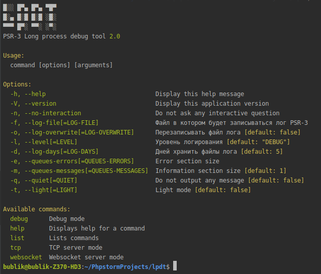

# PSR-3 long process debug tools

Инструмент помогает отлаживать долгие php процессы выполняемые по крону.
Процесс протоколируется по стандарту PSR-3.   
Инструменты:
    Отладка в консоли,
    Файловое логирование,
    Мониторинг процесса по средствам tcp сервера. 
    Мониторинг процесса по средствам websocket сервера.  
    
<a href="https://github.com/gbublik/lpdt/tree/master/doc">Документация</a>    
    

