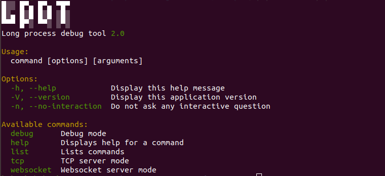
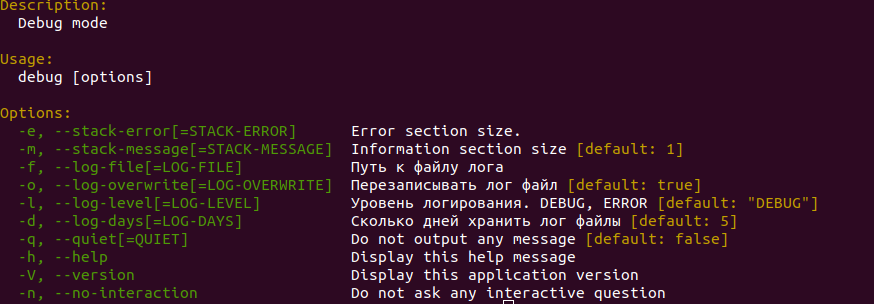
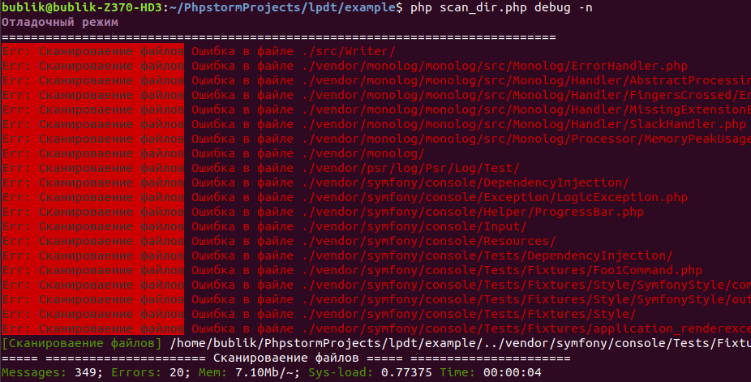

# Отладчик консольных php обработчиков



1. [Введение](/#introduction)
2. [Установка](/#install)
3. [Использование](/#command)
    1. [Отладочный режим](/#command:debug)
    2. [WebSocket logger server](/#command:websocket)
    

<a name="introduction"></a>
## Введение
В практике приходится сталкиваться с разработкой разных обработчиков на php,
которые выполняются долгое время по крону, например неделю.    
Сделать обмен данными с удаленным сервером, перенести пользователей 
с отдного ресурса на другой, парсер и т.п - задачи для решения которых 
пишется php скрипт предназначеный для запуска по крону.
В процесс разработки таких обработчиков, появляется ряд проблем для решения которых 
предназначена эта библиотека.  
   
**Проблемы:** В первую очередь, на стадии отладки, важно хорошо контролировать 
данные обрабатываемые в ходе исполнения алгоритмов обработчика.  Вывод ошибок, 
успешное добавления записи, 
время между операциями, понимать на какой стадии процесс обработки - все это нужная информация 
для отладки алгоритма обработчика. Обработчики обрабатывают  милионы записей, 
при этом возникает потребоность пороверять "Все ли правильно работает в обработчике за час работы". 
Важность отладочной ифнформации тоже отличается друг от друга, и меняется от задаче к задаче. 
Например на одной стадии  разработки важны ошибки добавления данных в базу данных, а на другой стадии 
видить целостность обрабатываемых данных, оценить скорость обработки данных. 
В одних случаи ошибки можно пропустить эти ошибки, в другом случаи нельзя... 
 
**Решение:** Протоколировать происходящие в процессе в файл и/или консоль.  
**LPDT** - библиотека манипулирования отладочной иформацие с возможностью контролировать данные и сам процесс
 в реальном времени.   
 LPDT придерживается [PSR-3](https://svyatoslav.biz/misc/psr_translation/#_PSR-3) стандарта протоколирования.   
После того как алгоритм пользовательского обработчика реализован, 
отладочную информацию можно перенаправить на веб страничку посредствам 
websocket сервера, или подключаться через telnet посредствам tcp сервера. 
Отладочная ифнормация могла бы пригодится "оператору данных" в ходе промышленной эксплутации.

<a name="install"></a>
## Установка
```console
user@user:~/$ composer gbublik/lpdt:dev-master
```

## Использование

Работать с LPDT можно двумя способами. 
1. Когда  обработчик реализауется с помощью класса(ов)
2. Простой php файл обработчика

### Реализация обработчика с помощию класса(ов)
**Гипотетическая задач:** Требуется реализовать обработчик файлов на жестком диске.
Во время обработки файлы могут содержать ошибки.

Класс обработчика реализует
[GBublik\Lpdt\HandlerInterface](#HandlerInterface) интерфейс.

```php
<?php
use GBublik\Lpdt\Writer\WriterInterface;
use GBublik\Lpdt\HandlerInterface;
use GBublik\Lpdt\LogServer;

require __DIR__.'/../vendor/autoload.php';

/**
 * Класс пользовательского обработчика.
 *
 * Предпологается что пользовательский обработчик может выполнять любую работу.
 * Реализовывать обработчики, которые могут работать с LPDT, можно двумя способами.
 *
 *      1)  В случаии если ваш  обработчик реализуется через класс, то подойдет следующее решение:
 *          В классе - реализающем логику обработчика, реализовать интерфейс GBublik\Lpdt\HandlerInterface.
 *          В интерфейсе 1 метод "execute". Метод вызывается автоматически во время запуская команды (debug или websocket),
 *          При запуске метода, в него передается объек предназначеный для работы с логом. Объект реализует
 *          интерфейс GBublik\Lpdt\Writer\WriterInterface (см. ниже).
 *
 *      2)  Отдельный файл в котором глобально будет достуен объект реализующий
 *          интерфейс GBublik\Lpdt\Writer\WriterInterface;
 *
 *
 * Интерфейс GBublik\Lpdt\Writer\WriterInterface имеет 4 метода.
 *      WriterInterface::write(string $str), // Отправляет сообщение. В случаеи debug - в консоль, в случаи websocket - подписчикам websocket сервера
 *      WriterInterface::error(string $str), // Отправляет сообщение об ошибки.
 *      WriterInterface::step(string $str) // Устанавливает текущий этап выполнения пользовательского обработчика
 *      WriterInterface::finish(string $str = null) //Финальное сообщение
 */
class ScanDirHandler implements HandlerInterface
{
    /** @var WriterInterface */
    protected $logger;

    /** @var int  */
    protected $iterator = 0;

    protected $amount = 0;

    protected $amountErrors = 0;

    /**
     * Единственный метод реализующий интерфейс GBublik\Lpdt\HandlerInterface
     * Метод будет запущен во время выполнения команды. Например: debug или websocket
     *
     * @param WriterInterface $log PSR-3 interface
     */
    public function execute(WriterInterface $log)
    {
        // Буду использовать логер в любом методе класса.
        $this->logger = $log;

        // Этап скинирования файлов
        $this->logger->step('Сканироваение файлов');
        // Запуск алгоритмов пользовательского обработчика
        $this->scanDir(__DIR__ . '/../');

        // Этап обработки фейковых данных
        $this->logger->step('Фейковые данные');
        $this->fakeData();

        //Финальное сообщение
        $this->logger->finish();
    }

    /**
     * Эмулирует полезную работу в виде обработкий файлов на жестком диске
     * @param string $target
     */
    protected function scanDir(string $target)
    {
        static $loading = [];
        foreach (glob( $target . '*', GLOB_MARK ) as $item) {
            $loading[] = $loading;
            $this->amount++;
            if(is_dir($item)){
                $this->scanDir($item);
            } else {
                $this->logger->info($item);
            }
            $this->iterator++;

            $item = str_replace([__DIR__, '/.'], '', $item);

            $this->doMakeHardWork();

            if ($this->iterator % 20 === 0) {
                $this->amountErrors++;
                $this->logger->error('Ошибка в файле ' . $item);
            }
            if ($this->iterator > 50) break;
        }
    }

    /**
     * Эмулирует полезную работу в виде обработкий данных полученных с удаленного сервера
     */
    protected function fakeData() {
        $this->logger->info('Запрос к удаленному серверу...');

        $result = @json_decode(@file_get_contents('http://jsonplaceholder.typicode.com/posts'), true);

        if (empty($result)) {
            $this->logger->error('Сервер не отдал данные');
        } else {
            $this->logger->info(sprintf('Прилетело %d записей', count($result) ));
        }

        foreach ($result as $key => $data) {
            $this->logger->info($data);
            $this->doMakeHardWork();
            if ($key % 40 === 0) {
                $this->logger->error(sprintf('Ошибка в данных %s:%d', $data['title'], $data['id']));
            }
        }
    }

    /**
     * Генерирует нагрузку
     */
    protected function doMakeHardWork()
    {
        $i = 0;
        while ($i < 10000000) {
            $i++;
        }
    }
}
```
Далее нужно создать объект логера и передать в его коструктор объект написанного
обработчика. Под копотом будет вызван метод execute и передан в него объект с интерфейсом
[GBublik\Lpdt\Writer\WriterInterface](#WriterInterface)

```php
// scan_dir_handler.php
new GBublik\Lpdt\LogServer(new ScanDirHandler);
```
Теперь запуская обработчик, скрипт будет работать как консольное приложение имеющее 
различные параметры запуска.
```console
user@user:~/$ php ./scan_dir_handler.php
```
или
```console
user@user:~/$ php ./scan_dir_handler.php list
```

## Отладочный режим (debug)

Отладочный режим имеет ряд параметров.
```console
user@user:~/$ php ./scan_dir_handler.php debug -h
```


<ul>
    <li>
        <b>stack-error</b> - Размер стека для вывода ошибочных сообщение в консоле уровнем WARNING и выше
        По умолчанию выводит все ошибки
    </li>
    <li>
        <b>stack-error</b> - Размер стека для вывода информационных сообщение уровнем выше WARNING
        По умолчанию 1 линия для выврода информац
    </li>
    <li>
        <b>log-file</b> - Файл проколирования. Имя файла для логирования по стандартам PSR-3
    </li>
    <li>
        <b>log-overwrite</b> - Если параметр задан, обработчик будет перезаписывать лог файл
    </li>
    <li>
        <b>log-level</b> - Уровень отладочной информации. DEBUG, INFO, SUCCESS, WARNING, ERROR, CRITICAL
    </li>
    <li>
        <b>log-days</b> - Если параметр log-overwrite не задан, к имени лог файла будет добавляться
        временная метка. На каждый день будет создан свой отдельный файл. Параметр определяет, сколько
        послених созданных лог файлов сохранять
    </li>
    <li>
        <b>quiet</b> - Ничего не выводить в консоль. Полезно при запуске по крону
    </li>
    <li>
        <b>help</b> - Справка по отладочному режиму
    </li>
    <li>
        <b>no-interaction</b> - Отвечать на интерактивные вопросы по умолчанию
    </li>
</ul>

Запуск обработчика с настройками по умолчанию
```console
user@user:~/$ php ./scan_dir_handler.php debug
```
